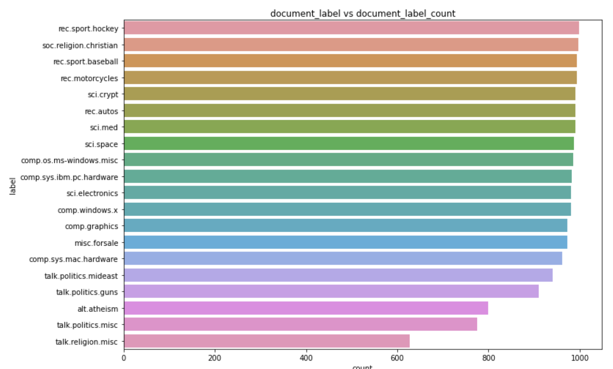
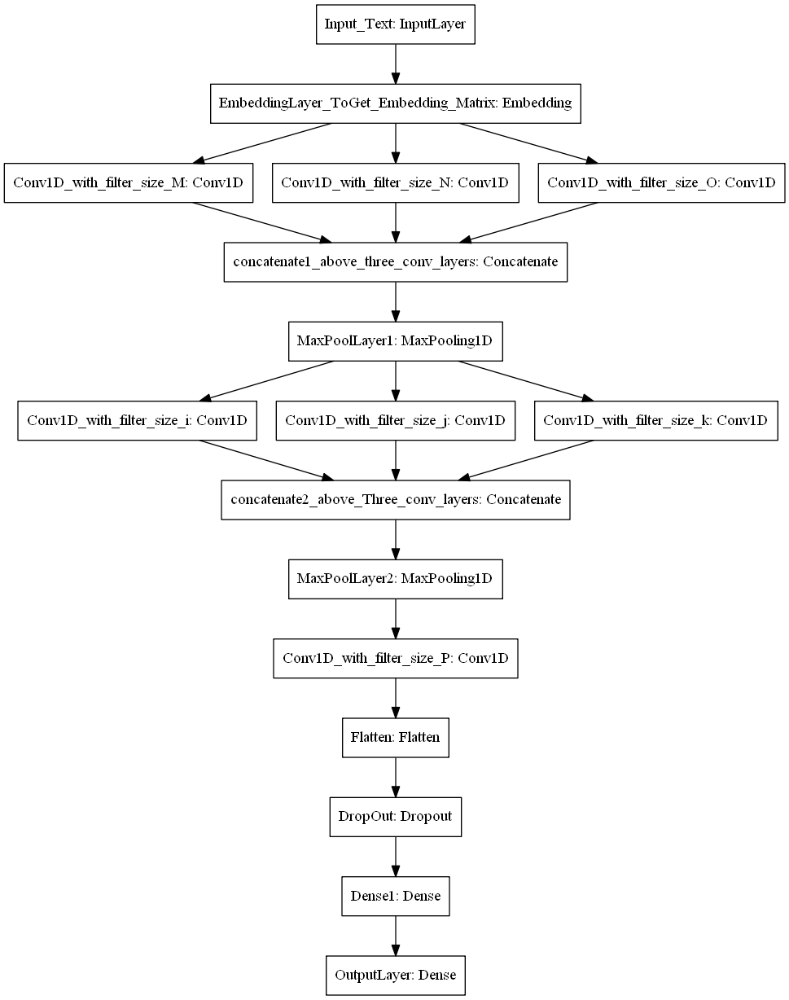
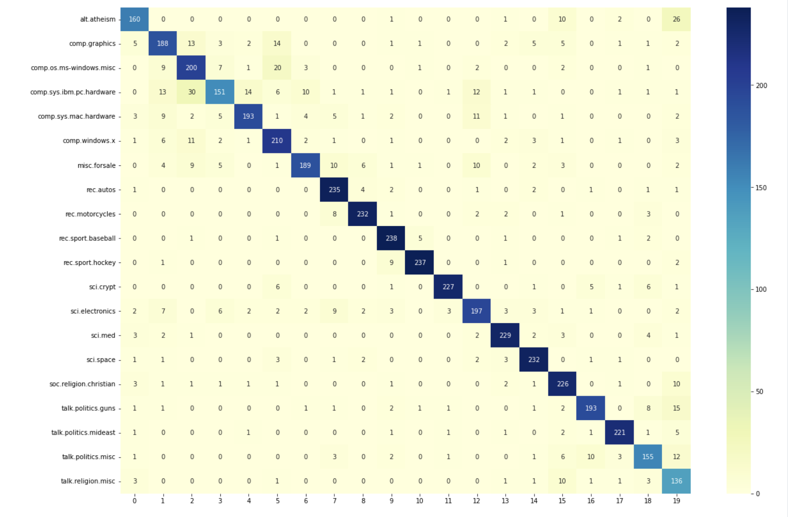

# Document-Classification
## Document Classification Using Tensorflow

The dataset is called **“Twenty Newsgroups”.**

The 20 Newsgroups data set is a collection of approximately 20,000 newsgroup documents, partitioned (nearly) evenly across **20 different newsgroups.** The 20 newsgroups collection has become a popular data set for experiments in text applications of machine learning techniques, such as text classification and text clustering.

In this notebook we will Explore how Conv1D can be used to learn a pattern from Text features.

We will build neural network classification Model using Tensorflow.

## Types of News
* comp.graphics
*   comp.os.ms-windows.misc
*   comp.sys.ibm.pc.hardware
*   comp.sys.mac.hardware
*   comp.windows.x	
*   rec.autos
*   rec.motorcycles
*   rec.sport.baseball
*   rec.sport.hockey	
*   sci.crypt
*   sci.electronics
*   sci.med
*   sci.space
*   misc.forsale	
*   talk.politics.misc
*   talk.politics.guns
*   talk.politics.mideast	
*   talk.religion.misc
*   alt.atheism
*   soc.religion.christian

## Label Distribution

## Training The models to Classify: 

<pre>
1. Combine "preprocessed_text", "preprocessed_subject", "preprocessed_emails" into one column. use that column to model. 

2. Split test train data using stratify split.

3. Analyze text data and pad the sequnce if required.  Sequnce length is not restricted, We will play with this hyper parameter.

4. Do Tokenizer i.e convert text into numbers.

5. code the model's ( Model-1, Model-2 ) as discribed below  and try to optimize that models.  

6. For every model use predefined **Glove vectors.**

7. Use **"categorical_crossentropy"** as Loss. 

8. Use **Accuracy and Micro Avgeraged F1 score** as your as Key metrics to evaluate your model. 

 

9. For Every model, we will save model to image ( Plot the model) with shapes and inlcude those images in the notebook markdown cell, 
upload those imgages to Classroom. You can use "plot_model" 
please refer <a href='https://www.tensorflow.org/api_docs/python/tf/keras/utils/plot_model'>this</a> 
</pre>

## Model 1 Architecture:

## Model1 Confusion Matrix

## Model1 Each class accuracy

| Label                    | model 1 class accuracy |
| ------------------------ | ---------------------- |
| alt.atheism              | 0.8                    |
| comp.graphics            | 0.773663               |
| comp.os.ms-windows.misc  | 0.813008               |
| comp.sys.ibm.pc.hardware | 0.616327               |
| comp.sys.mac.hardware    | 0.804167               |
| comp.windows.x           | 0.857143               |
| misc.forsale             | 0.777778               |
| rec.autos                | 0.947581               |
| rec.motorcycles          | 0.931727               |
| rec.sport.baseball       | 0.955823               |
| rec.sport.hockey         | 0.948                  |
| sci.crypt                | 0.915323               |
| sci.electronics          | 0.804082               |
| sci.med                  | 0.927126               |
| sci.space                | 0.939271               |
| soc.religion.christian   | 0.907631               |
| talk.politics.guns       | 0.85022                |
| talk.politics.mideast    | 0.940426               |
| talk.politics.misc       | 0.798969               |
| talk.religion.misc       | 0.866242               |
